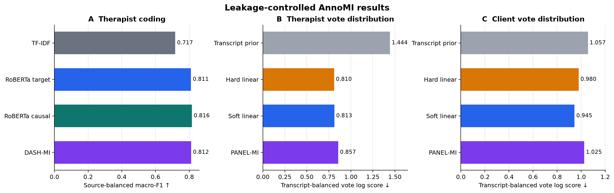
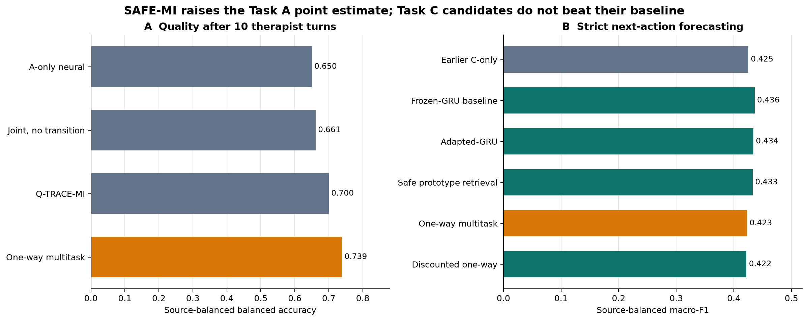
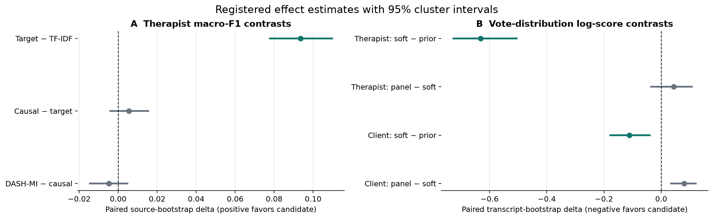

# AnnoMI Counselling Dialogue Analysis

A leakage-controlled, disagreement-aware benchmark for motivational-interviewing behaviour coding
on [AnnoMI](https://github.com/uccollab/AnnoMI). The project upgrades an earlier portfolio analysis
into a registered research pipeline with source-disjoint nested validation, five-seed neural
evaluation, row-level probability ledgers, paired cluster inference, negative-result retention, and
a separate multi-annotator label-distribution study.

> **Status:** all executable AnnoMI results below are complete and reconstruct from tracked
> evidence. External MI-TAGS confirmation awaits researcher-authorized access to the full corpus.
> The protocols are under [`configs/research/`](configs/research/); raw counselling text and model
> weights are not distributed.



## Main source-disjoint result

The primary task predicts four therapist-behaviour codes on 4,882 utterances from 119 normalized
video sources. Every reported prediction is out of source: model and recipe selection occur inside
each of five outer folds, and neural probabilities are averaged across five fixed seeds.

| Model | Source-balanced macro-F1 ↑ | Brier ↓ | Log loss ↓ | ECE ↓ |
|---|---:|---:|---:|---:|
| TF-IDF elastic net | 0.7172 | 0.3906 | 0.7670 | **0.0237** |
| RoBERTa, target only | 0.8108 | **0.2796** | **0.5587** | 0.0658 |
| RoBERTa, causal history | **0.8163** | 0.2838 | 0.5880 | 0.0800 |
| DASH-MI | 0.8116 | 0.2828 | 0.5883 | 0.0810 |

The defensible headline is nuanced:

- Target-only RoBERTa improves source-balanced macro-F1 over TF-IDF by **0.0935**, with a paired
  source-bootstrap 95% interval of **[0.0778, 0.1097]**. It passes the registered candidate gate.
- Causal-history RoBERTa is the **numerical F1 leader at 0.8163**, but its +0.0056 gain over
  target-only has interval **[-0.0040, 0.0154]** and its log loss is worse. It is not a supported
  replacement for the better-calibrated target-only model.
- DASH-MI reaches 0.8116. Its context residual changes only 0.53% of decisions, and neither its
  +0.0011 context-ablation delta nor its -0.0047 delta versus causal RoBERTa is supported.

Thus, **0.8163 is the best observed classification score**, while target-only RoBERTa is the best
supported and best probabilistic system. See the
[neural result](docs/research/ROBERTA_FLAT_CAUSAL_V1_RESULT.md),
[DASH-MI result](docs/research/DASH_MI_V1_RESULT.md), and
[paired inference](docs/research/DASH_MI_INFERENCE_V1.md).

## Early quality and next-action forecasting

The Task A/C track adds causal early-session quality classification and strict client-to-therapist
next-action forecasting. The later SAFE-MI campaign screened frozen and fold-adapted encoders,
GRU and attention contexts, asymmetric multitask transfer, bounded transition residuals, and
source-safe prototype retrieval before five-seed evaluation.

| Task | Earlier registered result | Updated exploratory point result | Interpretation |
|---|---:|---:|---|
| A: quality after 10 therapist turns | Q-TRACE-MI: 0.7000 balanced accuracy | **One-way multitask: 0.7389** | +0.0389 numerical; interval vs A-only crosses zero and Brier is worse |
| C: next therapist action | C-only: 0.4251 macro-F1 | **Frozen-GRU: 0.4359** | +0.0108 cross-run pipeline update; no SAFE-MI candidate beats its matched baseline |

The one-way Task A model improves over A-only in four of five seeds (+0.0889), but its paired-source
95% interval is [-0.0521, 0.2256] and its Brier degradation exceeds the frozen limit. For Task C,
safe prototype retrieval reaches 0.4328 macro-F1 versus 0.4359 for frozen-GRU while improving Brier
by 0.0053; the F1 interval [-0.0285, 0.0241] includes zero. Adapted-GRU passes a post-hoc descriptive
non-inferiority and prediction-set gate, with 0.8072 cross-fitted coverage and mean set size 2.4845.
No superiority claim is supported.



These tasks use no new manual labels. The quality target comes from source metadata and is not an
independent measure of clinical fidelity. The pre-access MI-TAGS audit quarantines 9 of 12 public
sample records as possible AnnoMI overlaps; the sample cannot support external performance. See the
[earlier Q-TRACE-MI result](docs/research/QTRACE_MI_V1_RESULT.md) and
[complete SAFE-MI result](docs/research/SAFE_MI_V2_RESULT.md).

## Multi-annotator result

No additional labeling is needed. AnnoMI already contains 428 utterances with ten annotations each
across seven transcripts. The registered leave-one-transcript-out study predicts the complete vote
distribution, models therapist and client codes separately, and treats seven transcripts—not 4,280
annotation rows—as the inferential units.

| Task | Model | Vote log score ↓ | Brier ↓ | JSD ↓ | Plurality macro-F1 ↑ |
|---|---|---:|---:|---:|---:|
| Therapist | Transcript prior | 1.4441 | 0.5953 | 0.3099 | 0.0818 |
| Therapist | Hard linear | **0.8099** | 0.2351 | 0.1381 | 0.7401 |
| Therapist | Soft linear | 0.8132 | **0.2245** | 0.1260 | **0.7430** |
| Therapist | PANEL-MI | 0.8567 | 0.2272 | **0.1169** | 0.7326 |
| Client | Transcript prior | 1.0566 | 0.3781 | 0.1822 | 0.2417 |
| Client | Hard linear | 0.9798 | 0.3235 | 0.1582 | 0.3399 |
| Client | Soft linear | **0.9453** | **0.3011** | **0.1453** | 0.4405 |
| Client | PANEL-MI | 1.0253 | 0.3380 | 0.1518 | **0.4724** |

Soft label-distribution learning beats the transcript prior on therapist log score by **-0.6309**
(95% interval **[-0.7257, -0.5055]**, exact sign-flip p = **0.0078**, 7/7 transcripts) and on
client log score by **-0.1113** (interval **[-0.1773, -0.0402]**, p = **0.0156**, 6/7).

The creative annotator-conditioned PANEL-MI model is an informative negative primary result. It
fails its registered log-score gate, although it gives the best therapist JSD and entropy error.
That Pareto trade-off is retained rather than relabeled as a win. The full method, failure log,
selection trace, and results are in the
[PANEL-MI report](docs/research/PANEL_MI_V1_RESULT.md).



## Why the evaluation is stronger

- Normalized source video URL, not utterance or transcript alone, is the dependency group for the
  main benchmark.
- Every outer fold is retained; no favorable fold is selected.
- Tokenization, PCA, scaling, class weights, early stopping, and recipe choice are training-only.
- Inputs are causal: the target utterance and, where registered, preceding turns only.
- Every metric reconstructs from out-of-fold probability ledgers whose hashes are recorded.
- Bootstrap sampling respects source or transcript clusters. Seeds and annotation rows are never
  treated as independent samples.
- Smoke gates, numerical failures, convergence fallbacks, ablations, and failed success gates remain
  visible.

The dataset creators describe AnnoMI as 133 professionally transcribed, expert-annotated
demonstration dialogues and explicitly distinguish it from real therapy sessions
([Wu et al., 2023](https://doi.org/10.3390/fi15030110)). Accordingly, this repository makes no
clinical-validity, therapist-ranking, causal-effect, or state-of-the-art claim.

## Reproduce

Python 3.11 and a CUDA GPU with BF16 support reproduce the registered neural runs. The sparse and
multi-annotator heads run on CPU after frozen embedding extraction.

```bash
uv sync --extra analysis --extra dev --extra neural
python tools/download_dataset.py --variant simple
python tools/download_dataset.py --variant full

python -m annomi_research audit-data
python -m annomi_research make-splits
python -m annomi_research validate
pytest -q

python -m annomi_research check-neural-env
python -m annomi_research smoke-neural --model roberta_utterance
python -m annomi_research run-neural --model roberta_utterance
python -m annomi_research smoke-neural --model roberta_flat_causal10
python -m annomi_research run-neural --model roberta_flat_causal10
python -m annomi_research smoke-dash
python -m annomi_research run-dash
python -m annomi_research smoke-panel
python -m annomi_research run-panel

python -m annomi_research run-ac-baselines
python -m annomi_research smoke-qtrace
python -m annomi_research run-qtrace
python -m annomi_research smoke-safe-mi
python -m annomi_research run-safe-mi
python -m annomi_research run-safe-mi-extension
python -m annomi_research audit-mi-tags

python tools/build_research_assets.py
python tools/build_ac_assets.py
python tools/build_safe_mi_assets.py
python tools/validate_repository.py
```

Evidence writers are create-only: an identical rerun is a safe no-op, while a different payload
must use a new output lineage. Dataset files are commit-pinned and checksum-verified before fitting.
See the [locked protocol](docs/research/LOCKED_PROTOCOL.md),
[validity audit](docs/research/VALIDITY_AUDIT.md), and
[result lineage](docs/RESULT_LINEAGE.md).

## Repository map

```text
configs/research/                 Locked machine-readable protocols and comparisons
src/annomi_research/              Audits, splits, models, inference, and validators
results/research/                 Reconstructable out-of-fold evidence and summaries
results/research/publication_v1/  Derived exact tables plus a hash manifest
results/research/publication_ac_v1/  Derived Task A/C tables plus a hash manifest
results/research/publication_safe_mi_v2/  SAFE-MI tables, intervals, and audit manifest
docs/research/                    Registrations, execution logs, and result reports
assets/research/                  Script-generated publication figures
tests/                            Fast contracts for data, models, metrics, and evidence
tools/                            Pinned download, validation, and asset builders
```

The earlier single-holdout portfolio result remains in the notebook and legacy result directories as
development-consumed evidence. It is not silently deleted and is not the source-disjoint headline.

## License and attribution

Original code and documentation are MIT licensed. AnnoMI and pretrained encoders are separate
third-party works and are not redistributed here. Review
[THIRD_PARTY_NOTICES.md](THIRD_PARTY_NOTICES.md) before reuse.
