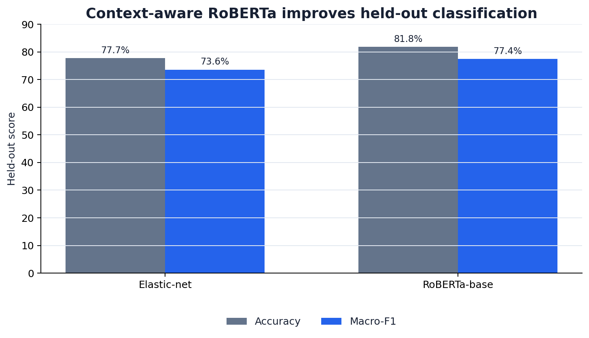
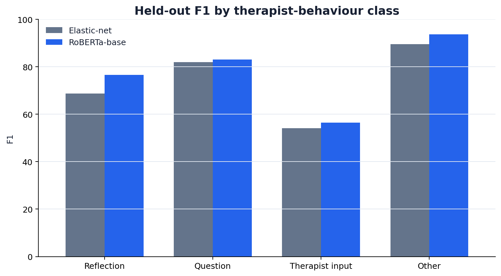
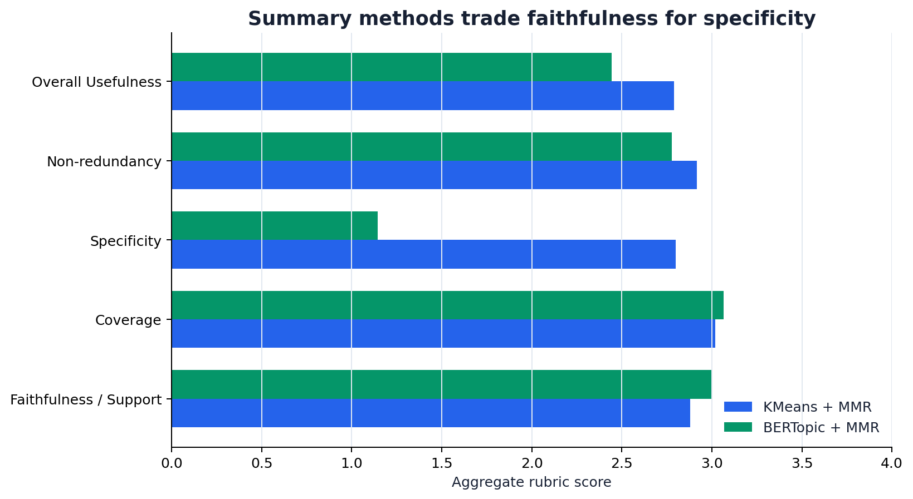

# AnnoMI Counselling Dialogue Analysis

A reproducible NLP benchmark for therapist-behaviour classification on the
[AnnoMI](https://github.com/uccollab/AnnoMI) counselling-dialogue corpus. The
central comparison uses transcript-grouped evaluation to prevent dialogue leakage and
contrasts a sparse elastic-net baseline with a context-aware RoBERTa classifier.

## Headline result

The RoBERTa system improves held-out macro-F1 by **3.86 percentage points** and
accuracy by **4.11 points** across 973 therapist utterances from 31 unseen transcripts.

| Model | Accuracy | Macro-F1 | Weighted F1 | Multiclass Brier |
|---|---:|---:|---:|---:|
| Elastic-net logistic regression | 77.70% | 73.58% | 77.44% | 0.3192 |
| RoBERTa-base, grouped search + three seeds | **81.81%** | **77.44%** | **81.47%** | **0.2938** |



Transcript-level resampling keeps the dependence structure intact. The 95% interval
for the accuracy gain is **[1.77, 6.26] points**; for macro-F1 it is
**[1.51, 6.43] points**. Exact McNemar testing gives **p = 0.0006**, with 85
RoBERTa-only correct cases versus 45 baseline-only correct cases.

## Evaluation design

- **Data:** 9,699 utterances from 133 transcripts; raw counselling text is not tracked.
- **Target:** reflection, question, therapist input, or other on therapist turns.
- **Split:** 102 training transcripts and 31 held-out transcripts.
- **Baseline:** elastic-net logistic regression over sparse text/context features.
- **Encoder:** `FacebookAI/roberta-base`, ten-turn context, maximum length 384,
  grouped hyperparameter search, and confirmation across seeds 17, 42, and 101.
- **Uncertainty:** transcript-grouped bootstrap and permutation inference, plus paired
  McNemar testing on the fixed held-out items.
- **Calibration:** temperature scaling lowers RoBERTa Brier score from 0.2938 to 0.2860
  and ECE from 0.1073 to 0.0877 without changing top-1 predictions.



## Supporting experiments

The tracked evidence also covers three secondary questions:

- **Extractive summarisation:** KMeans + MMR is the aggregate winner on the recorded
  rubric, with 2.790 overall usefulness versus 2.445 for BERTopic + MMR. BERTopic has
  higher average faithfulness/support and coverage, but substantially lower specificity.
- **Transcript-quality classification:** elastic-net and XGBoost both reach 90.32%
  accuracy and 0.727 F1 on the fixed test partition; intervals are wide because the test
  set is small.
- **Next-behaviour forecasting:** CatBoost and a hybrid GRU both reach 44.60% top-1
  accuracy. CatBoost leads top-2 accuracy, 76.16% versus 72.56%.



## Repository layout

```text
annomi_counselling_dialogue_analysis.ipynb  Executed portfolio analysis
experiments/pipeline_source.ipynb          Code-only full experiment pipeline
src/annomi_portfolio/                       Evidence loading and consistency checks
results/                                    Curated aggregate result lineage
tools/                                      Dataset, figure, notebook, and validation tools
tests/                                      Fast evidence-contract tests
docs/                                       Protocol and model documentation
```

## Quick start

```bash
python -m venv .venv
# Activate the environment, then:
python -m pip install -e ".[analysis,dev]"
python tools/validate_repository.py
pytest -q
jupyter lab annomi_counselling_dialogue_analysis.ipynb
```

Download the pinned dataset only when rerunning data-dependent stages:

```bash
python tools/download_dataset.py
```

The downloader verifies the upstream commit, byte count, SHA-256 digest, schema, row
count, and transcript count before moving the file into `data/raw/AnnoMI/dataset.csv`.
Install `requirements-experiment.txt` before running the full pipeline. Model checkpoints
and local training outputs are intentionally excluded from version control.

## Reproducibility and scope

Result tables are immutable evidence exports from the completed runs. Their hashes and
source-notebook hash are recorded in `results/provenance.json`; tests check arithmetic,
split integrity, statistical intervals, and the summarisation ranking. Full neural
retraining remains hardware- and library-sensitive, so newly trained runs should be
written to a fresh output directory and compared against, not silently substituted for,
the tracked evidence.

Counselling language is sensitive and context dependent. These models are research
benchmarks, not clinical decision systems, therapist-quality scores, or substitutes for
professional review. See [the model card](docs/MODEL_CARD.md) and
[experiment protocol](docs/EXPERIMENT_PROTOCOL.md) for limitations.

## License and attribution

Original code and documentation are MIT licensed. The dataset and pretrained models are
separate third-party works and are not redistributed here. See
[THIRD_PARTY_NOTICES.md](THIRD_PARTY_NOTICES.md) before reuse.
